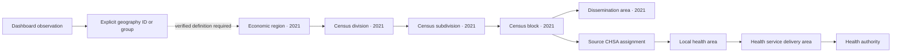

# How B.C.'s geographies connect

Project: `/dev/projects/bc-connected-geographies`.
Package: `public/data/projects/bc-connected-geographies.json` (`story-map-v1`, slides).

The canonical joining methodology and build script are in
`vendor/bcdatamapper/datascrapers/bc/boundaries/geography-bridge/README.md` and
`build.py`. Generated snapshots are in `boundaries/output/GeographyBridge` and
use the existing boundary sync rule. Never commit their generated public copies.

This project explains the ID bridge among economic regions, census divisions,
census subdivisions/blocks and the four-level health hierarchy. It uses the
existing story renderer without new application components. Economic-region
popups join a compact profile table at runtime; all geometry is reused unchanged.
Sources and downloads exposes the full bridge, pair comparisons, manifest,
methodology and State of the North dataset/field registry.

The diagram is relational, not a containment assertion across the census and
health branches. Source IDs retain vintage and provenance. The DB bridge covers
52,387 records and all 751 official 2021 CSD IDs; the 533 blocks with unresolved
health parents remain visible. The 36 extra population records identified by the
upstream crosswalk are outside the bridge. Health display polygons come from a
local index with a different CHSA code set and are not asserted to match 2021.

Twelve comparisons pair ER/CD/CSD with CHSA/LHA/HSDA/HA. Every comparison preserves
the covered population and DB count, including missing-parent buckets. Consumers
must select one comparison before summing. Population shares describe residents;
they do not justify automatic conversion of economic values to health areas.

Only the vacancy pilot has table-specific geography links in this release.
Combined North Coast/Nechako observations remain single rows. Northern B.C.
remains definition-unverified. Other dashboard tables are inventoried, with
geography review requirements for facilities, markets, routes, tax areas and
NDIT service regions. No new data refresh or blanket indicator conversion is implied.

Validation: run the bridge's Python unit tests, the PGMaps package audit and
`bcConnectedGeographies.test.ts`, then inspect all six slides at desktop/phone
widths. Verify the region profile popup, map layers and Sources and downloads.

## Verified release checks

- Bridge unit tests: conservation of block/population/dwelling totals across all
  12 comparisons; census-side shares including unknowns; Prince George paths;
  combined-region observation retention; byte-identical rebuilds.
- Package audit, source/highlight/profile tests, catalog index check and full
  PGMaps production build passed.
- All six scenes traversed forward/backward at desktop and 390×844 phone size;
  economic-region profile popup and Sources and downloads inspected. Browser
  console had no warnings/errors during this pass. All seven download endpoints
  returned readable payloads.
