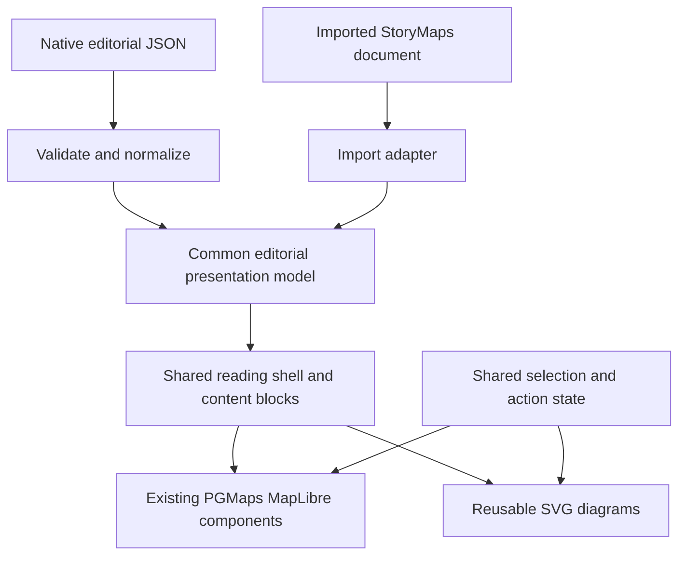

# Native editorial stories and data-driven diagrams

Status: implemented foundation, 2026-09-27. The authoritative shipped schema is
[native-editorial-stories.md](native-editorial-stories.md); the sketches below
record design intent and are not a substitute for that contract.

Delivered: native document parsing and shared audit validation, a complete native
example, shared reading shell, reusable radial hierarchy and categorical dots,
map/diagram category selection, typed narrative actions, GeoJSON/PMTiles map
surfaces, and imported capability checks. Prague now shares `EditorialShell`
and the presentation components while retaining its source graph adapter and
credited media. Each source format adapts to common presentation props; no
conversion to a fake ArcGIS graph or replacement of the original diagrams is
needed. The generic map components/source resolver are reused without changing
the older scene orchestrator.

Bounded initial scope: native editorial does not yet accept climate-grid maps,
per-view category recoloring, document-specific theme overrides, or slideshow
sidecars. Those source/theme/presentation variants remain available where
specified by the existing scene/import contracts. Dot positions are explicitly
authored rather than synthesized by the renderer. A drag-and-drop editor and
analytical diversity metrics remain separate future work.

## Recommended architecture

Extend the existing `story-map-v1` workspace's `document` union with a native
editorial format. Keep ordinary scene packages and the ArcGIS import format
working. Use a common presentation model behind the existing cover, navigation,
sidecar, tour, gallery and comparison components.

The native format should describe reading order and content. Maps should refer
to named views backed by the existing layer/source and scene-resolution code.
This keeps narrative authoring independent of source protocols without building
another map engine or copying the full scene renderer into each block.



Normalize source-specific content at the boundary. Preserve imported rich text,
credits, media, authored map styling and provenance. An import with unsupported
content must report its node ID and capability rather than silently omit it.
Move the import path to the common model only after parity checks pass.

## Native authoring contract

Proposed package reference:

```json
{
  "workspace": {
    "type": "story-map",
    "schema": "story-map-v1",
    "document": {
      "schema": "pgmaps-editorial-v1",
      "data": "/data/story-documents/my-story/story.json"
    }
  }
}
```

This is a partial envelope, not a complete registrable package. Keep documents
and their media outside `public/data/projects`, whose recursive indexer expects
project packages. Keep scraper data in its existing scraper-owned location.

Prefer a bounded, ordered document over a generic page-builder graph:

- A versioned root with `chapters`, `maps`, `views`, `media`, `diagrams`,
  `actions`, optional `cover`, and credits. Chapter IDs drive navigation.
- A discriminated `StoryBlock` union: prose, heading, quote, list, figure,
  carousel, map, comparison, sidecar, tour, diagram, separator and credits.
- Sidecar steps contain prose blocks and one media reference. Tours contain
  stops, media, text and optional map-view references. Disallow nested tours or
  sidecars inside each other initially; the existing sticky layouts do not
  provide arbitrary nested scrolling.
- Structured rich text: text, emphasis, strong text, safe link and action
  reference. No executable expressions or arbitrary JSX/CSS in JSON. Imported
  HTML stays behind its existing allowlist adapter during migration.
- Stable IDs for chapters, blocks, slides, stops, views, actions and diagrams.
  Resolve references once; show validation paths for unknown IDs, duplicated
  IDs, invalid URLs and unsupported block/subtype combinations.
- Typed map definitions: a native layer collection, or an imported WebMap
  resource. Native layers reuse `ProjectStoryLayerDef`; native views reuse the
  camera, visible layers, highlights, overrides, places and legend semantics
  already implemented for scenes. Do not reuse narrative `sceneLabel` as a
  universal key: new views have stable IDs, while legacy scenes keep working.

Example block fragments (proposed, not runnable today):

```json
[
  {
    "id": "changing-city",
    "type": "sidecar",
    "presentation": "docked",
    "side": "left",
    "steps": [
      {
        "id": "old-centre",
        "content": [{ "type": "paragraph", "text": "Explore the old centre." }],
        "media": { "type": "map", "mapId": "city", "viewId": "old-centre-view" }
      }
    ]
  },
  {
    "id": "urban-groups",
    "type": "diagram",
    "diagramId": "urban-taxonomy"
  }
]
```

Use one explicit theme policy for native editorial documents: app theme by
default, with light/dark overrides. Keep thematic category colors separate from
surface/text tokens. Retain the original media option for exact reproductions.
Do not change the current native sidecar `paper`/`ink` behavior as a side effect.

## Runtime boundaries and map lifetime

Extract an `EditorialShell` from `EditorialStory`: bounded scroll root,
`--editorial-viewport` measurement, chapter navigation/observation and project
toolbar. Keep the PGMaps navbar outside it. Reuse `StoryCover`, `StorySidecar`,
`StoryTour`, `StoryCarousel`, `ExpandableMedia` and `MapSwipe` unchanged where
their props already express the behavior. Extract figure/credits presentation
from the importer as needed. Put data parsing in adapters, not those components.

The native map surface needs a focused extraction from `ProjectStoryMap`:
source loading, layer rendering and camera fitting, without its narrative UI.
Reuse `useStorySources` and `storyScene` rules, including loading/error reporting,
legends and selection. A JSON map block should not mount another complete
`ProjectStoryMap` with its own shell. Preserve the current imported map adapter
as another map-definition implementation.

Scope map instances to active media regions: one retained map per sidecar or
tour, two for a visible comparison. Change views on those instances. Do not
mount every chapter's map eagerly, key a map by the active step, or rebuild its
style when a diagram selection changes. Release distant inactive regions using
a bounded lifetime policy and restore their camera/selection on re-entry.
Comparison queries remain driven by the primary viewport's settled movement.

Use a small typed action layer for `select-category`, `set-map-view` and
`go-to-chapter`, with explicit targets. Diagram callbacks and map feature clicks
update the same selected IDs. An action updates state once; rendering the
selection must not dispatch the action again. `set-map-view` affects its map
region without scrolling the narrative; `go-to-chapter` explicitly scrolls.
Actions on inactive maps store desired state without waking every map.

## Circular hierarchy component

Build a reusable `RadialHierarchy` with React-rendered SVG and a pure layout
function. D3 is already a declared dependency in PGMaps. Its
[cluster layout](https://d3js.org/d3-hierarchy/cluster) can place leaves on a
common outer radius; [radial links](https://d3js.org/d3-shape/radial-link) supply
curved connections. Use D3 for geometry and React for DOM/state ownership.

Input should include stable node IDs, labels, parent IDs, category IDs and
optional action references. Require one rooted acyclic hierarchy with existing
parents; preserve authored sibling order. Weights are optional and must have an
explicit meaning: branch angle/length must not imply population or similarity
unless that quantity is actually encoded. Initially use topological depth, not
an invented analytical distance.

Expose selected IDs, `onSelect`, shared category colors, a title and a textual
description. Focus/selection highlights the node and ancestor path; activating a
bound action may highlight matching map features. Keep diagram data independent
of geographic coordinates and map implementation.

On phones retain the circular overview, offer expansion, and provide a readable
nested list for selection and labels. Do not solve label collisions by shrinking
text indefinitely. Include keyboard-operable selection, visible focus and text
equivalents; color and hover cannot be the only way to understand a branch.

Economic regions and health authorities form overlapping classifications, not
one tree. Do not turn their crosswalk into parent-child edges to fit this chart.
Use the existing relationship bars/membership paths, or a separately specified
relationship matrix/network when that is the intended question.

## Colored-dot explanation component

Build `CategoryDotDiagram` separately from the hierarchy. It should accept
stable point IDs, normalized positions, category IDs and authored explanatory
steps. Steps change the selected region, highlighted categories, annotations or
explicit positions. Shared IDs preserve dot identity across steps.

Support two clearly distinguished inputs:

- **Measured points:** positions/categories supplied by a dataset. Preserve the
  supplied distribution and document what one dot represents.
- **Illustrative points:** explicitly labeled teaching data, with deterministic
  grid or seeded placement. Generate once in a pure function, not on each render
  or breakpoint change. Do not present this arrangement as measured geography.

Use SVG for the small explanatory diagrams. Keep coordinates in a stable
`viewBox`; CSS resizing must not change the sample being explained. Avoid a
continuous physics simulation. Honor reduced motion when interpolating authored
steps; let the sidecar's active step drive the diagram, not a second scroll
observer.

Keep categories and palette in one registry shared with the legend and map.
If displaying a diversity statistic, specify the formula, sampling rule,
denominator and empty-sample behavior in a separate pure calculation module;
the presentation component should not choose the statistic. Show counts/text
alongside the visual. If a use case exceeds an agreed mark budget, validate and
report that limit; sampling or aggregation must be explicit, not silently change
the lesson.

The Prague illustrations and taxonomy currently supply images. Reconstructing
their exact underlying classifications/point arrangements requires source data
or an explicitly authored illustrative dataset. Keep the original images for
faithful reconstruction until that equivalence is established.

## Implementation sequence and proof

1. **Native document and first working example.** Add the versioned union,
   parser and shared validator; extract the shell and native map surface; render
   cover/prose/figure plus one sidecar in a new example using existing local
   source data. No change to Prague's active rendering path yet.
2. **Complete presentation coverage.** Add carousel, tour, comparison, credits
   and typed action bindings. Build an independently authored example containing
   every supported block. Demonstrate changing only JSON to reorder chapters,
   switch sidecar presentation, replace content and link map views.
3. **Diagram blocks.** Add pure layout/data validation and the two SVG
   components; integrate them through the same media slots and action state.
   Demonstrate map-to-diagram and diagram-to-map selection plus phone list
   selection. Use explicit teaching data where appropriate.
4. **Import convergence.** Normalize supported imported content into the same
   presentation model; compare all Prague content, actions, credits and reading
   flow before switching it over. Keep imported WebMap normalization separate
   from native data adapters. Report unsupported source capabilities explicitly.

Suggested ownership (new paths are proposals):

| Concern | Location |
| --- | --- |
| Workspace document union/dispatch | `src/lib/projectPackages.ts`, `src/maps/project-workspace/ProjectWorkspace.tsx` |
| Native document types, parser and validation | `src/maps/project-story/editorial/model/` |
| Imported document conversion | `src/maps/project-story/editorial/adapters/` |
| Shell and block composition | `src/maps/project-story/editorial/` |
| Generic diagram presentation | `src/components/ui/diagrams/` |
| Pure diagram layout/calculations | `src/lib/diagrams/` |
| Package audit and capability guidance | `.agents/skills/pgmaps-project-builder/` |

Have runtime and package audit consume the same validation/capability definitions
where practical. For each delivered block update types, parser, renderer,
authoring docs, skill reference, audit and a real example together. Proposed
blocks remain marked unavailable until that slice passes.

Unit tests should cover invalid references, unknown blocks, cycles, stable
layouts, point/category integrity, action targets and any actual statistics.
Browser tests should prove desktop/phone reading order, reversible navigation,
keyboard/touch controls, theme/reduced motion, selected map/diagram IDs, retained
map canvases and delayed-network behavior. Use deterministic local or stubbed
data for core checks and separate remote integration checks. Run the existing
scene-layout regressions after extracting their map surface and the complete
Prague checks before migrating its adapter. Do not treat a cleanup timeout or
unavailable service as a clean browser run.

The first deliverable should be one native editorial example, not a visual
drag-and-drop editor. Its validated JSON contract gives AI authoring a stable
target and can support an editor later without another renderer redesign.
