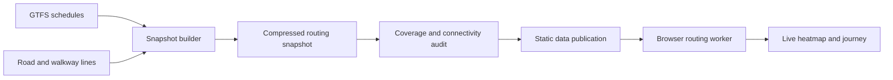

# Transit travel-time pipeline

The pipeline combines a scheduled GTFS feed with a walking graph, publishes a
compressed routing snapshot, and generates travel-time colours live in a browser
worker. Prince George is the implemented example at `/dev/transit`.

The routing, street-access index, heat raster, animation and audit approach can
be reused. The current implementation is **configured for Prince George**;
adding another city still requires extracting the settings listed below.
This document describes that future refactor, not an existing city-config API.

## Stages and ownership



| Stage | Implementation | Contract |
| --- | --- | --- |
| Build and source archives | `vendor/bcdatamapper/datascrapers/transit/` | Scraper-owned Python tools, GTFS archive, snapshot and spatial audit report |
| Deploy data | `scripts/sync-bcdatamapper-data.mjs` | Copies scraper outputs to generated, ignored `public/data/transit/` |
| Snapshot schema | `src/pages/dev-transit/types.ts` | `pg-travel-time-v1`: schedules, shapes, walking graph, access preferences, metadata and fallback grid |
| Route calculation | `routing.ts` | Connection scan preserves scheduled trip identity; Dijkstra calculates walking access and egress |
| Shared access | `street-access.ts` | One spatial index per immutable snapshot, shared by marker routing and heat samples |
| Live sampling | `live-grid.ts`, `travel.worker.ts` | Visible bounds, zoom-dependent spacing and a 120,000-cell budget |
| Display | `heat-raster.ts`, `TravelLayers.tsx`, `DevTransit.tsx` | Interpolated minutes, theme palettes, contours, persistent heat image and marker interaction |
| Validation | Python audit, `access-sweep.test.ts`, routing tests and Playwright | Independent snapshot/browser comparisons, connectivity checks and real interaction checks |

The snapshot is loaded separately from application JavaScript. Route calculation
and heat generation run locally after loading it; they do not call a routing
server. Address search is a separate, explicit request to the BC Address Geocoder.
There are no live transit delays or automatic feed refreshes.

## Data and routing semantics

- The builder selects GTFS service for one reference date using `calendar` and
  `calendar_dates`. The current importer accepts bus `route_type=3` only.
- Connections use seconds since the beginning of the reference service day,
  including values beyond 24:00. Trip identity, sequence, pickup/drop-off
  permissions, headsigns and shape indices remain intact.
- A trip with any stop outside the study rectangle is excluded in full. Cropping
  never joins stops across an omitted intermediate stop.
- Walking is bidirectional at 1.25 m/s. Roads and walkways are simplified by 8 m
  and sampled at no more than 80 m. Source endpoints project onto nearby segments
  within 12 m; matched edges are split. Interior crossings alone do not create
  junctions, so an overpass does not become a junction just because lines cross.
- Stops use up to 180 m estimated access. Markers and heat samples share a
  snapshot-configured 350 m limit. Access walking contributes to travel time.
  The main road-connected component takes priority over smaller isolated assets
  within the same radius. An isolated fallback remains separate and is labelled.
- Boarding requires a one-minute allowance; staying on the same vehicle does
  not incur it again. Transfers follow the walking graph for up to 650 m.
- Heat cells contain elapsed minutes, with `-1` for unreachable cells. Access
  cells contain `[nodeIndex, accessMetres]` or `null`. Snapshot input hashes,
  service date, feed validity and model limits provide provenance.

Straight-line access connectors estimate the trip from a selected point to the
mapped network. They do not validate entrances, sidewalks, private access,
pedestrian crossings, water barriers or accessibility. Network travel follows
recorded edges; no disconnected graph component is repaired by adding an
arbitrary long link. Park trails absent from the source remain absent.

## Live behaviour to preserve

Dragging A or B makes that point the heat origin and recalculates before release.
Only the final point is committed to the share URL. The worker keeps one active
job and one latest pending job, and discards incompatible timetable/mode results.
The heat canvas remains in place, blending finished raster frames without a
bright clear frame. A drag into missing or isolated access retains the last
connected preview with a notice; releasing commits the actual result.

Camera changes rebuild the padded viewport's access grid. Colour-scale and
theme changes reuse the route solution. Raster interpolation works on minutes
before applying the palette, and preserves missing access. Light and dark
palettes use the same time thresholds. Contours are estimates. More display
pixels improve appearance rather than source-network accuracy.

Stop hover cards are suspended while a marker is dragged, a pointer button is
held, or the map moves. Clicking controls or releasing a marker must not also
place a destination. Desktop, mobile, sharing and reduced motion remain part of
the interaction contract; see [the map guide](dev-transit.md).

## Settings to extract for another city

| Setting | Current Prince George location | Future configuration/adapter |
| --- | --- | --- |
| City identity, title, centre and presets | `DevTransit.tsx`, `state.ts` | City ID, display name, default origin/camera and example destinations |
| Study rectangle and URL validation | Builder `BBOX`, `state.ts` | One shared bounds definition used by build, audit, state and rendering |
| Metric projection and distance calculations | Builder `LAT0`/`xy`, `street-access.ts`, `routing.ts` | City-appropriate metric transform with matching Python/TypeScript calculations |
| GTFS source and feed selection | Builder BC Transit URL/operator 22; archive argument | Feed adapter, feed provenance, service date and supported route types |
| Timezone | Pacific UI labels; service-day interpretation | GTFS agency timezone, validated and carried into metadata and UI |
| Street/path inputs and output naming | Builder `citypg/output`, PG snapshot filename, `DevTransit.tsx` fetch URL | Source adapters and a per-city snapshot URL |
| Walking/access/transfer parameters | Builder constants and `--access-meters` | One documented model policy, recorded in snapshot metadata |
| Address search | `PlaceSearch.tsx` BC provider and PG query suffix | Provider adapter and city hint; local stop search remains available |
| Regression origins, facilities and bounds | Python audit and PG unit/e2e fixtures | City-specific coverage probes, facility inputs and expected journeys |

A future city definition should be consumed by the builder, auditor and client
together. Generating a small public manifest from the same definition avoids
duplicated bounds, projections and access limits. Keep source-specific parsing
in adapters and reuse the routing/renderer contract. Adding a city should then
mean preparing its inputs and definition, building and auditing its snapshot,
and publishing its manifest and data.

Rail, subway, ferry, extended GTFS route types and frequency-based service need
additional importer and validation work. The current bus implementation does
not claim support merely because those services can be described by GTFS.

## Rebuild and release the Prince George example

From the PGMaps root, with submodules initialized:

```sh
# Reproduce the committed example with its retained official feed.
python3 vendor/bcdatamapper/datascrapers/transit/build-travel-time.py \
  vendor/bcdatamapper/datascrapers/transit/source/prince_george_gtfs_2026-10-07.zip \
  --date 2026-10-07 --grid-meters 50 --access-meters 350

python3 vendor/bcdatamapper/datascrapers/transit/test-travel-time.py
python3 vendor/bcdatamapper/datascrapers/transit/audit-travel-time.py --strict \
  --baseline vendor/bcdatamapper/datascrapers/transit/source/prince_george_travel_time_pre_access_sweep.json.gz
npm run data:sync-from-bcdatamapper
npx vitest run src/pages/dev-transit/
npm run build
```

For a fresh feed, follow the scraper's
[rebuild instructions](../vendor/bcdatamapper/datascrapers/transit/TRAVEL-TIME.md)
and choose a service date inside its validity. Retain the input archive with its
owner, update date-sensitive journey expectations, and rebuild the audit before
publishing. An unchanged-input rebuild should produce the same compressed hash.

The GitHub Pages deployment workflow runs the Python junction tests, strict
coverage audit and transit unit/browser-code sweep before the production build.
The audit report for that run is written to the runner's temporary directory,
leaving the committed historical coverage report unchanged.

The Python audit sweeps the whole PG study rectangle at 50 m spacing: 270,810
locations and 135 civic/park facilities. It reports inaccessible locations and
isolated components, checks reported regression points, and fails strict mode
for inconsistent marker/heat access or isolated preferred components. With
`--baseline /path/to/previous-snapshot.json.gz`, it also compares coverage.
The browser-code sweep compares every fallback-grid cell against the independent
Python builder and actual marker snapping. The 50 m sweep is a sampling check,
not proof of pedestrian access at every continuous point.

The saved PG audit records three facilities in Forest for the World with no
mapped access. Preserve these residuals as known data gaps rather than inventing
trails to make a coverage percentage look complete.

Before a release, exercise the map's Playwright spec for dragging/hover, flash-free
heat, journey controls, sharing, data retry and mobile layout. Reuse successful
checks when inputs have not changed. Commit and push the scraper snapshot and
tools first, then commit its submodule pointer with the PGMaps application and
docs. Never add generated `public/data/transit` copies to PGMaps Git.

The standalone Sites publication is another wrapper around the same map modules
and generated data. Its `npm run audit:access` checks the full city grid and the
reported origins without a browser. Sites source/version publication is separate
from pushing the PGMaps and scraper repositories to GitHub main.
